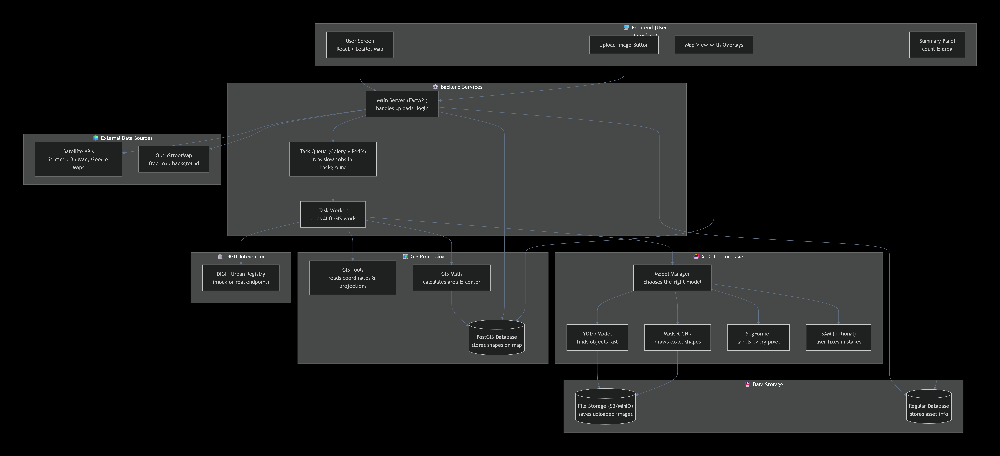
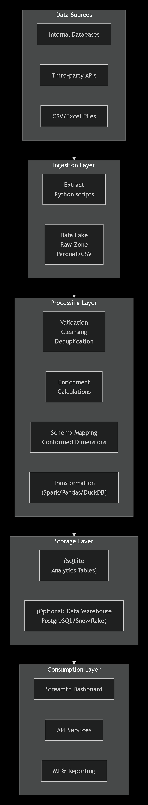

# 📈 Bluestock Mutual Fund Analytics Dashboard

## Bluestock Internship Capstone Project

An end-to-end Mutual Fund Analytics platform developed as part of the **Bluestock Internship Program**. The project covers data ingestion, ETL processing, exploratory data analysis, performance analytics, investor analytics, risk analytics, recommendation systems, and an interactive Streamlit dashboard.

---

## 🚀 Project Overview

The objective of this project is to analyze mutual fund industry data and provide actionable insights through interactive dashboards and advanced analytics.

### Key Features

* Industry AUM Analysis
* SIP Growth Analysis
* Fund Performance Evaluation
* Alpha, Beta, Sharpe & Sortino Analysis
* Investor Behaviour Analytics
* T30 vs B30 Analysis
* Market Benchmark Tracking
* Historical VaR & CVaR Analysis
* Rolling Sharpe Ratio Analysis
* Fund Recommendation Engine
* Interactive Streamlit Dashboard

---

# 🏗 Project Architecture



---

# 📊 ETL Pipeline

## Data Sources

The project utilizes the following datasets:

* Fund Master Data
* Fund Performance Data
* Investor Transaction Data
* Industry AUM Data
* SIP Inflow Data
* Benchmark Index Data

---

## ETL Workflow

> Insert ETL Flow Diagram Here


### Extract

Data collected from:

* CSV Files
* Industry Reports
* Internal Databases

### Transform

Performed operations:

* Missing Value Handling
* Duplicate Removal
* Data Standardization
* Feature Engineering
* Data Validation

### Load

Final processed data loaded into:

```text
SQLite Database (bluestock_mf.db)
```

---

# 🗂 Project Structure

```text
bluestock_mf_capston/
│
├── dashboard/
│   ├── app.py
│   ├── style.css
│   ├── utils.py
│   ├── assets/
│   │   └── bluestock_logo.png
│   │
│   └── pages/
│       ├── 1_Industry_Overview.py
│       ├── 2_Fund_Performance.py
│       ├── 3_Investor_Analytics.py
│       └── 4_Market_Trends.py
│
├── data/
│   └── db/
│       └── bluestock_mf.db
│
├── notebooks/
│   ├── 01_data_ingestion.ipynb
│   ├── 02_data_cleaning.ipynb
│   ├── 03_eda_analysis.ipynb
│   ├── 04_performance_analytics.ipynb
│   └── 05_advanced_analytics.ipynb
│
├── reports/
│   └── During_Internship/
│
├── scripts/
│   ├── etl_pipeline.py
│   ├── recommender.py
│   └── run_pipeline.py
│
├── requirements.txt
├── README.md
└── .gitignore
```

---

# 🗄 Database Tables

## fact_fund_master

Contains:

* AMFI Code
* Scheme Name
* Fund House
* Category
* Plan Type

---

## fact_performance

Contains:

* Returns (1Y, 3Y, 5Y)
* Alpha
* Beta
* Sharpe Ratio
* Sortino Ratio
* AUM
* Expense Ratio
* Risk Grade

---

## fact_transactions

Contains:

* Investor Transactions
* Demographic Information
* Transaction Amounts
* SIP Activity

---

## fact_monthly_sip_inflows

Contains:

* Monthly SIP Collection
* SIP Growth Metrics

---

## fact_benchmark_indices

Contains:

* NIFTY 50
* Sensex
* Other Benchmark Indices

---

# 📈 Dashboard Modules

## 1️⃣ Industry Overview

Provides:

* Industry AUM Trends
* SIP Collection Growth
* Folio Analysis
* Top Fund Houses

> Add Dashboard Screenshot Here

---

## 2️⃣ Fund Performance

Provides:

* Risk vs Return Analysis
* Sharpe Ratio Analysis
* Alpha/Beta Comparison
* Fund Scorecards
* Benchmark Comparison

> Add Dashboard Screenshot Here

---

## 3️⃣ Investor Analytics

Provides:

* State-wise Investments
* Gender Distribution
* Age Group Analysis
* T30 vs B30 Investor Analysis

> Add Dashboard Screenshot Here

---

## 4️⃣ Market Trends

Provides:

* SIP Trend Analysis
* Category Inflow Heatmaps
* Benchmark Tracking
* Market Performance Analysis

> Add Dashboard Screenshot Here

---

# 📉 Advanced Analytics

## Historical VaR & CVaR

### Value at Risk (95%)

Measures the maximum expected loss at a 95% confidence level.

### Conditional Value at Risk (CVaR)

Measures the average loss beyond the VaR threshold.

Output:

```text
var_cvar_report.csv
```

---

## Rolling Sharpe Ratio

Calculated using:

```text
Rolling 90-Day Sharpe Ratio
```

Output:

```text
rolling_sharpe_chart.png
```

---

## Investor Cohort Analysis

Analyzes investor behaviour based on first transaction year.

Output:

```text
cohort_analysis.csv
```

---

## SIP Continuity Analysis

Identifies:

* Consistent Investors
* At-Risk Investors

Output:

```text
sip_continuity.csv
```

---

## Fund Recommendation Engine

Risk Profiles Supported:

* Low
* Moderate
* High

Recommendation Criteria:

* Sharpe Ratio
* Sortino Ratio
* Alpha
* Historical Returns

Output:

```text
recommended_funds.csv
```

---

## Sector Concentration Analysis

Calculated using:

### Herfindahl-Hirschman Index (HHI)

Measures portfolio concentration risk.

Output:

```text
sector_hhi.csv
```

---

# 🔍 Key Findings

### 1. Industry Growth

Indian Mutual Fund Industry AUM crossed ₹68 Lakh Crore, demonstrating significant growth in retail participation.

### 2. SIP Boom

Monthly SIP collections reached record levels, reflecting strong investor confidence and disciplined investing.

### 3. Risk-Adjusted Performance

Several Moderate-risk funds delivered better Sharpe Ratios than higher-risk alternatives.

### 4. Investor Concentration

T30 cities contributed a significant share of total investments compared to B30 regions.

### 5. Fund House Dominance

A small group of leading AMCs controlled a substantial share of total industry assets.

### 6. Downside Risk

Certain schemes exhibited elevated VaR and CVaR levels, indicating higher downside risk exposure.

### 7. SIP Consistency

Investors maintaining regular SIP schedules demonstrated stronger long-term investment discipline.

---

# ⚙ Installation

Clone the repository:

```bash
git clone <repository-url>
cd bluestock_mf_capston
```

Install dependencies:

```bash
pip install -r requirements.txt
```

---

# ▶ Running ETL Pipeline

```bash
python scripts/run_pipeline.py
```

---

# ▶ Running Dashboard

```bash
streamlit run dashboard/app.py
```

---

# 📦 Deliverables

### Reports

* Final_Report.pdf
* Bluestock_MF_Presentation.pptx

### Dashboard

* Streamlit Dashboard

### Analytics Outputs

* var_cvar_report.csv
* cohort_analysis.csv
* sip_continuity.csv
* sector_hhi.csv
* rolling_sharpe_chart.png
* recommended_funds.csv

---

# 🔮 Future Enhancements

* Real-Time NAV Integration
* Live Market Data APIs
* Portfolio Optimization Models
* Return Forecasting Models
* Power BI Deployment
* Cloud Deployment

---

# 👨‍💻 Author

**Akshat Bansal**

Bluestock Mutual Fund Analytics Capstone Project

Bluestock Internship Program

2025

---

# 📜 License

This project was developed for educational and internship evaluation purposes under the Bluestock Internship Program.
